# BlockOps Complete System Workflow Diagrams (Current Implementation)

This document maps the current codebase behavior across frontend, backend, AI services, wallet/signing paths, ERC-8004 identity, Filecoin audit storage, scheduling, Telegram linking, and payment gating.

## 1. High-Level System Architecture

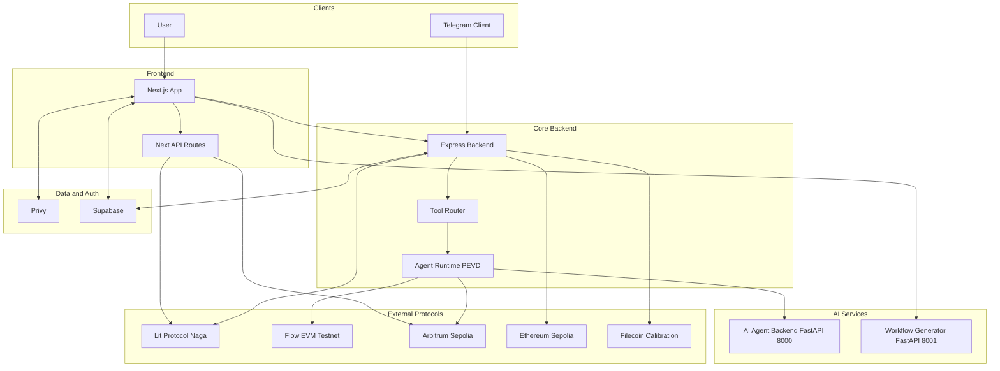

## 2. Entry Surfaces and Routing Modes

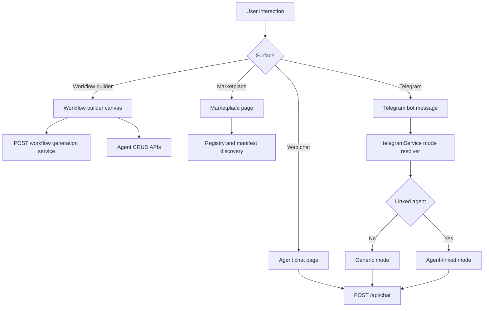

## 3. Chat Runtime Execution Flow

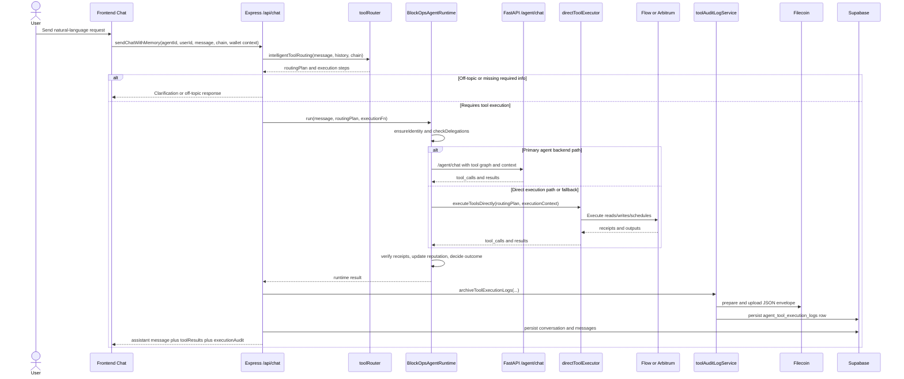

## 4. Conversation Memory Modes

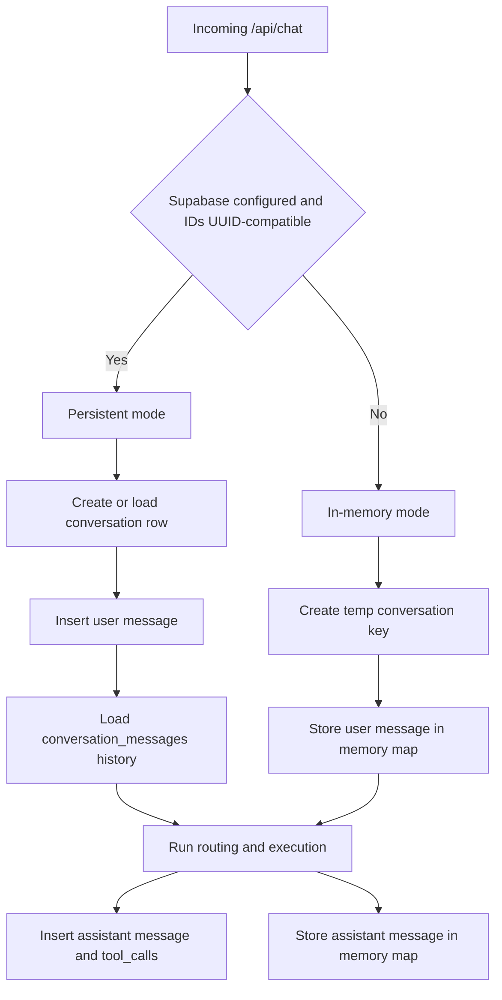

## 5. Wallet Setup and Signing Paths

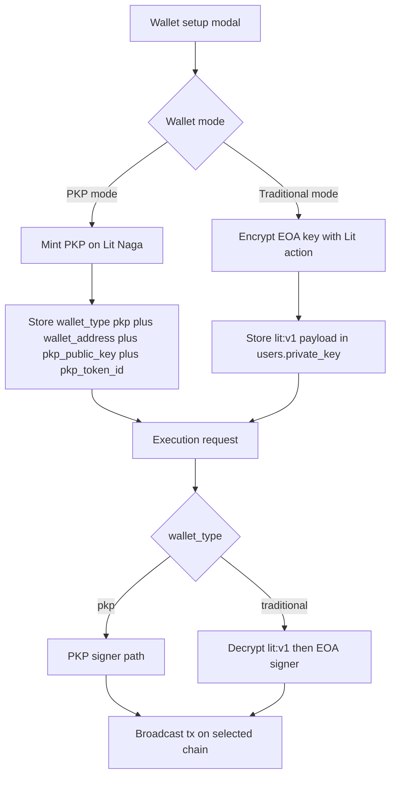

## 6. Lit Integration Route Map

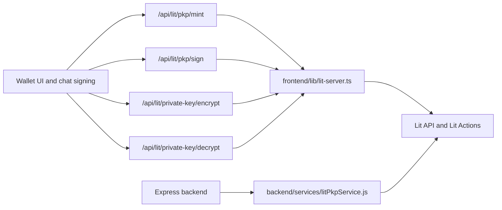

## 7. Chain Routing and Tool Scope

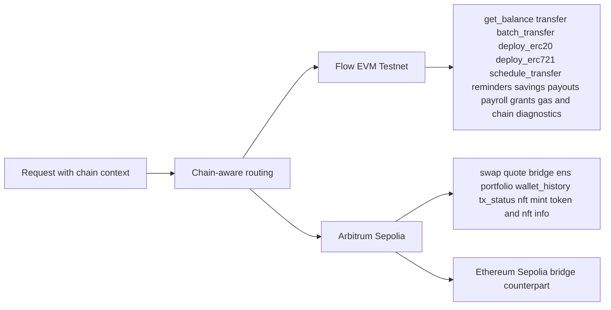

## 8. Scheduling and Reminder Engines

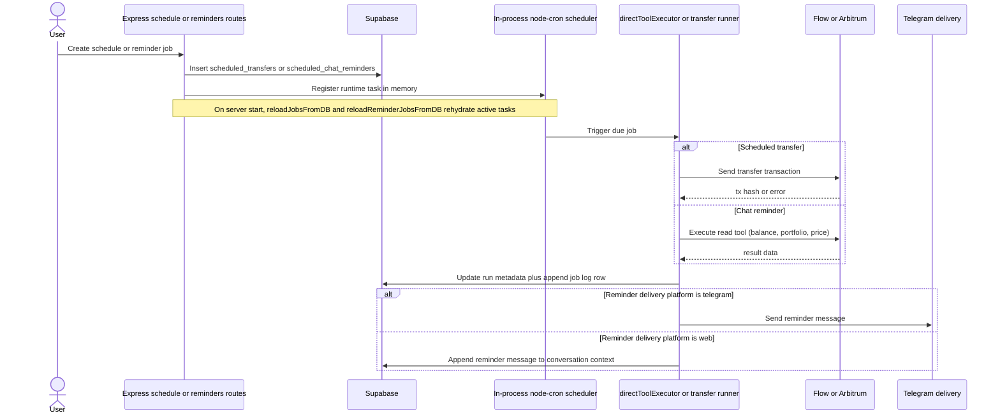

## 9. Telegram Generic and Agent-Linked Modes

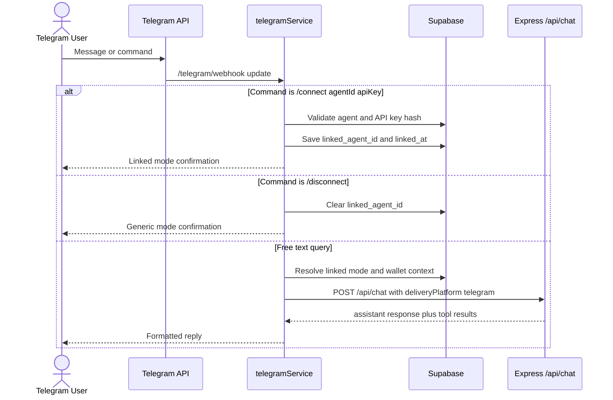

## 10. ERC-8004 Runtime, Registry, and Trust Flow

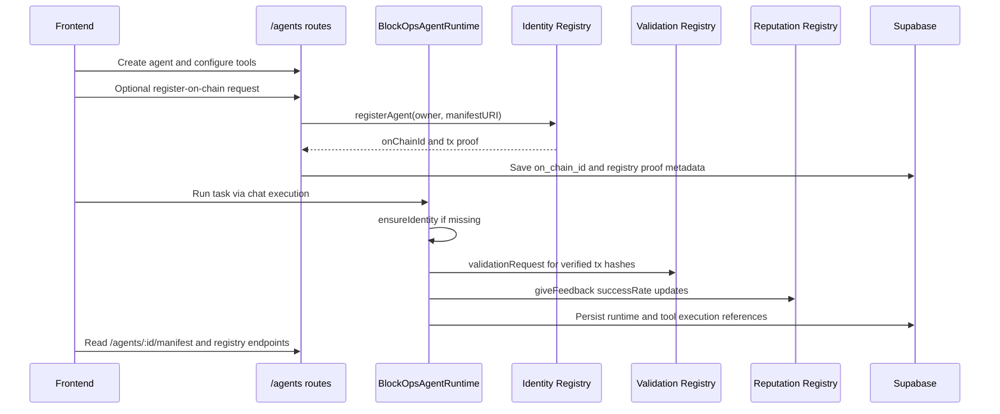

## 11. Filecoin Audit Lifecycle

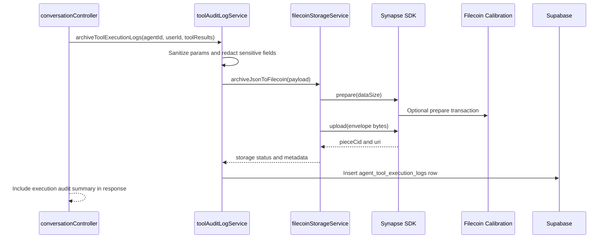

## 12. Agent Registry Discovery and Marketplace

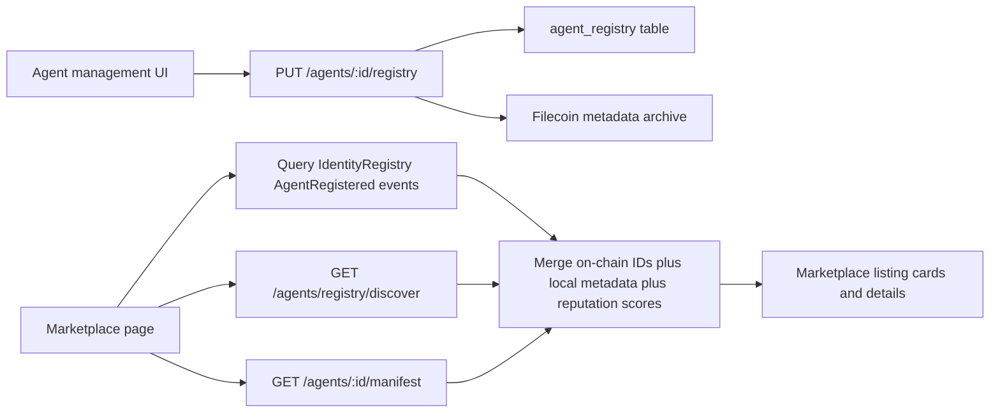

## 13. x402 Payment and AI Quota Gating

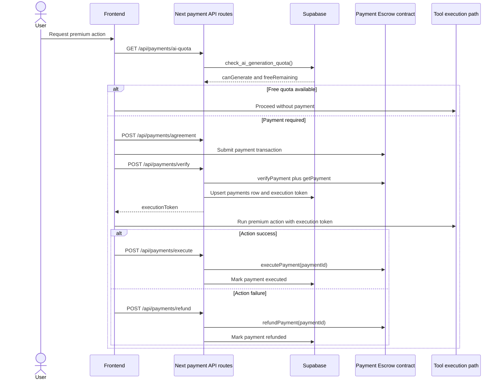

## 14. API Topology Map

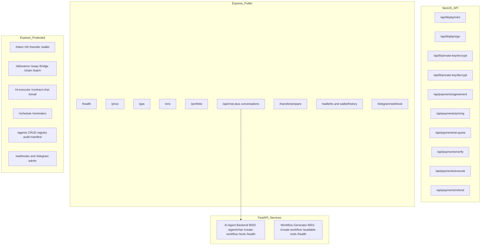

## 15. Core Data Model Relationships

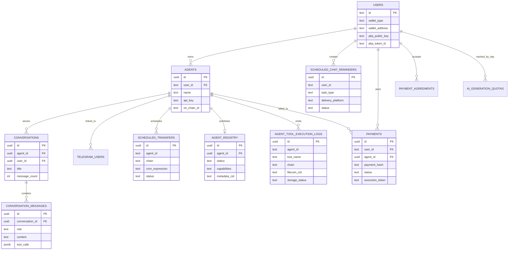

## Summary

The current BlockOps implementation is represented as:

1. Multi-surface entry points: web chat, workflow builder, marketplace, and Telegram.
2. Chain-aware execution with Flow EVM Testnet as default and Arbitrum Sepolia for advanced tooling.
3. Runtime orchestration with ERC-8004 identity, verification, and reputation updates.
4. Dual wallet model with Lit PKP and Lit-encrypted traditional key compatibility.
5. Filecoin-backed audit logs indexed in Supabase.
6. Scheduling and reminder automation with DB reload on startup.
7. Optional x402 payment gating and AI quota enforcement through Next.js API routes.

This document is intended to match current code paths, not the older single-chain architecture.